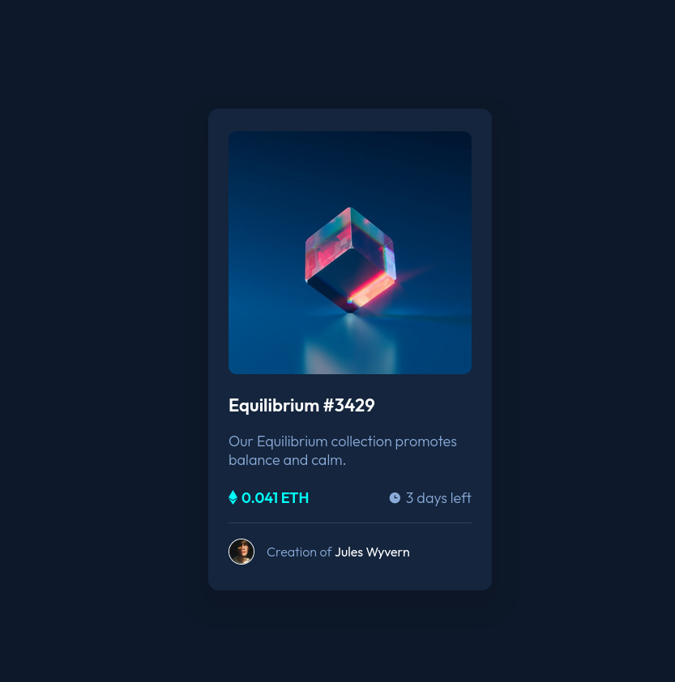

# Exercício 07 | Cartão NFT

## Aplicando tecnicas de flexbox, Grid e Pseudo elementos

Colocando em prática todos os estudos até agora de HTML e CSS avançado

### Link para acessar:

https://lucasramosfs.github.io/projeto07-cartao-nft/ 

